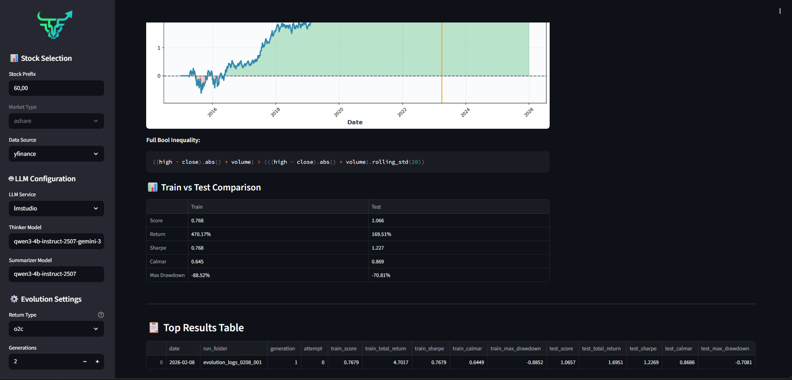

# BoolQuant

**English** | [中文](README_ZH.md)


LLM-Driven Boolean Rule Evolution for Stock Selection

> **100% Local.** Zero API calls. Your data, your models, your alpha. No leakage, ever.



---

## Quick Start

### 1. Install Dependencies
```bash
pip install -r requirements.txt
```

### 2. Set Up Local LLM
Install and run a local LLM server using **LM Studio** or **Ollama**.

**Recommended GGUF models (4GB+ VRAM):**

- **Thinker** (reasoning/analysis):  
  [Qwen3-4B-Instruct-2507-Gemini-3-Pro-Preview-Distill-GGUF](https://huggingface.co/TeichAI/Qwen3-4B-Instruct-2507-Gemini-3-Pro-Preview-Distill-GGUF) or [Falcon-H1R-7B-GGUF](https://huggingface.co/tiiuae/Falcon-H1R-7B-GGUF)

- **Summarizer** (final output):  
  [Qwen3-4B-Instruct-2507-GGUF](https://huggingface.co/byteshape/Qwen3-4B-Instruct-2507-GGUF)

⚠️ **Always use different models for thinker and summarizer**—this separation yields cleaner reasoning and more concise final responses. Never reuse the same model for both roles.


### 3. Configure Settings
Edit `config.json` to set key parameters:

| Parameter | Description |
|-----------|-------------|
| `generations` | Number of evolution cycles |
| `attempts` | Rule mutations per generation |
| `amount_rank_n` | Stock pool size (e.g., 5-20) |
| `return_type` | `o2c`, `o2o`, `c2c`, or `c2o` |
| `transaction_fee` | Default: 0.0007 |
| `train_test_ratio` | Train/test data split |

### 4. Run the App
```bash
streamlit run app.py
```

## UI Usage

1. **Configure** parameters in the left sidebar:
   - **Stock Selection**: Data source and prefix filters
   - **LLM Configuration**: Choose local LLM service and models
   - **Evolution Settings**: Generations, attempts, return type
   - **Data Filter**: Optional amount ranker for stock pool size
   - **Date Range**: Select backtest period
   - **Train/Test Split**: Set ratio for validation

2. **Run Evolution** tab: Click "Run Evolution" to start the genetic algorithm

3. **Results** tab: View top performing rules, plots, and performance metrics

4. **Stock Selector** tab: Test boolean conditions on specific dates

---

## How It Works

BoolQuant evolves **human-readable boolean rules** to select stocks based on LLM generated indicators from basic ohlcv:

```
((close - low) / (high - low) * volume) > ((close - low) / (high - low) * volume).shift(1)
```

### Evolution Process
1. **LLM generates** rule mutations based on backtest feedback
2. **Rules are evaluated** on historical train data
3. **Top performers** are selected and mutated
4. Process repeats for N generations
5. **Best rules** are tested on held-out test data

### Focused Stock Pool Selection

Unlike traditional portfolio optimization methods that may output hundreds of candidates, BoolQuant's **Stock Pool Ranker** is designed to produce a **small, focused list** (typically 5-20 stocks) for research analysis.

This compact approach enables:
- **In-depth review** of each candidate's characteristics
- **Manageable scope** for technical or fundamental analysis
- **Clear interpretability** of what the rules are selecting

The system ranks stocks by trading volume and applies evolved boolean rules to filter the pool. **Always follow the provided selection hint** (e.g., "select from the first 5 stocks whose open price is between 0.97× and 0.99× preclose") to ensure:
- **No lookahead bias**: Uses only information available at decision time
- **Reproducible methodology**: Deterministic, rules-based selection
- **Research discipline**: Prevents arbitrary cherry-picking

This focused output is designed for research and educational exploration, not as trading recommendations.

---

## Requirements

- Python 3.10+
- Local LLM server (Ollama or LM Studio)

---

## Data Quality

⚠️ **yfinance data quality**: Data may be missing, inaccurate, or retroactively corrected without notice—use at your own discretion.

⚠️ **Data source consistency**: Same rules may behave differently across data sources—stick to one source for consistent results.

## Disclaimer

**BoolQuant is a personal research project for educational purposes only.**

- Not intended for production trading or investment decisions
- No warranties or guarantees of any kind
- Past backtest performance does not predict future results
- Use at your own risk for research purposes only

---

## License

Personal Open Research License. See LICENSE file for details.
